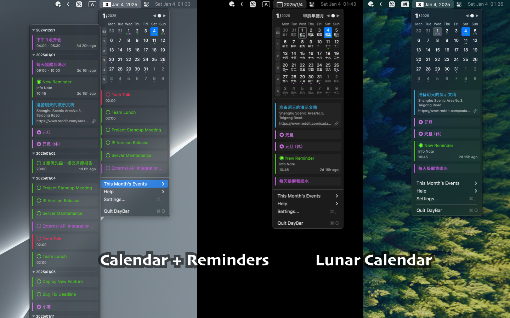

   
   
  
  <h1>
    DayBar
  </h1>
  <!--rehype:style=border: 0;-->
  

    <a href="./README.zh.md">简体中文</a> • 
    <a target="_blank" href="https://github.com/jaywcjlove/daybar/issues/new?template=bug_report.yml">Contact & Support</a> • 
    <a href="https://github.com/jaywcjlove/daybar/releases">Changelog</a>
  

  

    
  

DayBar is an app that displays local date reminders and events in the menu bar. By clicking on the DayBar in the menu bar, you can view your calendar, calendar events, and reminders, which can also be synchronized with Apple Calendar events. The app is designed to consolidate calendar and reminder functions in the status bar menu, making it easy to manage and view them.

### Features

- Chinese lunar calendar display  
- Week number display  
- Event indicator  
- Double-click to quickly access the calendar  
- Display all events for the current month  