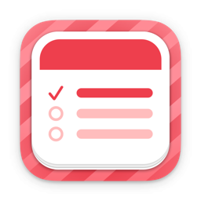

<!--idoc:ignore:start-->
> [!TIP]
> Declaration: This project is not an open-source project. The repository serves as the official website, used to collect issues and user demands. This is done to save costs, because without an official website, the application cannot pass the review.
<!--idoc:ignore:end-->

   
   
  
  <h1>
    DayBar
  </h1>
  <!--rehype:style=border: 0;-->
  

    <a href="./README.zh.md">简体中文</a> • 
    <a target="_blank" href="https://github.com/jaywcjlove/daybar/issues/new?template=bug_report.yml">Contact & Support</a> • 
    <a href="./CHANGELOG.md">Changelog</a>
  

  

    
  

DayBar is an application that displays the local date and reminder events in the menu bar. Click on DayBar in the menu bar to view the calendar, calendar events, and reminders, and it supports synchronization with Apple Calendar. It integrates calendar and reminder functions into the status bar menu for easy management and viewing, while turning reminders into simple and beautiful to-do items.

### Features

- Display Chinese lunar calendar  
- Display current week number  
- Event indicator  
- Double-click to quickly open Calendar and Reminders  
- Show all events of the current month  
- Reminder for TODO tasks  