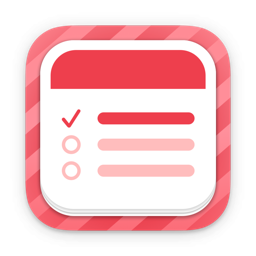
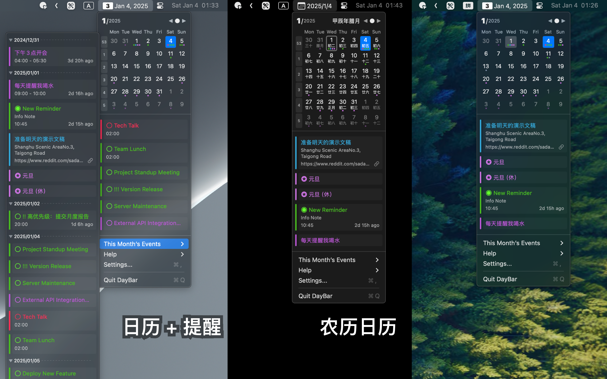

   
   
  
  <h1>
    DayBar 日历吧
  </h1>
  <!--rehype:style=border: 0;-->
  

    <a href="./README.zh.md">简体中文</a> • 
    <a target="_blank" href="https://github.com/jaywcjlove/daybar/issues/new?template=bug_report_cn.yml">联系&支持</a> • 
    <a href="https://github.com/jaywcjlove/daybar/releases">变更日志</a>
  

  

    
  

DayBar 是一款可以在菜单栏展示本地日期和提醒事件的应用。点击菜单栏中的 DayBar，您可以查看日历、日历事件以及提醒事项，并且可以与 Apple 日历事件进行同步。此应用旨在将日历和提醒功能集中在状态栏菜单，方便管理和查看。

### 主要功能

- 显示中国`农历`
- 显示当前周数
- 事件指示器
- 双击快速进入日历
- 展示本月所有事件

<!--version: v1.0.0-->