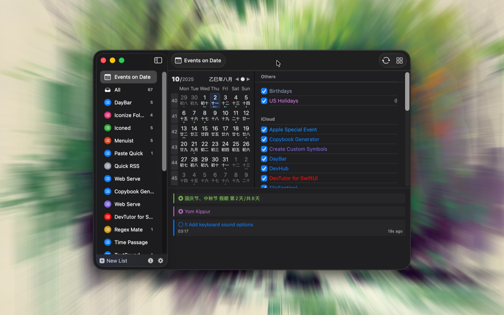

<!--idoc:ignore:start-->
> [!TIP]
> 声明：此项目并非开源项目，仓库作为官方网站，用于收集问题和用户需求。这样做是为了节省成本，因为没有官网，应用无法通过审核。
<!--idoc:ignore:end-->

   
   
  
  <h1>
    DayBar 日历吧
  </h1>
  <!--rehype:style=border: 0;-->
  

    <a href="./README.md">English</a> • 
    <a target="_blank" href="https://github.com/jaywcjlove/daybar/issues/new?template=bug_report_cn.yml">联系&支持</a> • 
    <a href="https://github.com/jaywcjlove/daybar/releases">变更日志</a>
  

  

    
  

DayBar 是一款在菜单栏显示本地日期和提醒事件的应用。点击菜单栏中的 DayBar，即可查看日历、日历事件和提醒事项，并支持与 Apple 日历同步。它将日历和提醒功能整合到状态栏菜单，方便管理和查看，同时让提醒事项呈现为简洁美观的待办事项。

### 主要功能

- 显示中国农历
- 显示当前周数
- 事件指示器
- 双击快速进入日历和提醒
- 展示本月所有事件
- 提醒待办事项 TODO

<!--version: v1.0.0-->